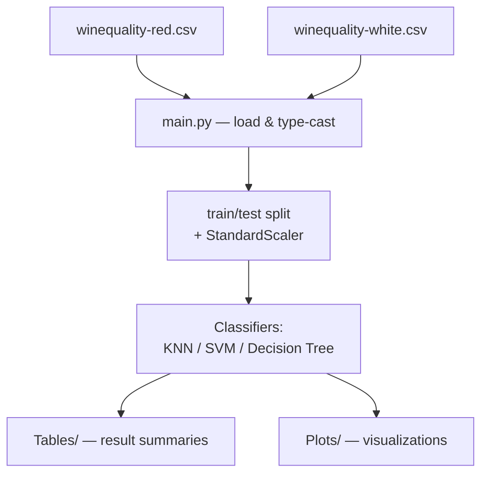

# Wine Quality Classification

Classification experiments (KNN, SVM, decision trees) on the UCI Wine Quality dataset (red and white variants), exploring how physicochemical properties predict wine quality ratings.

## Data

`winequality-red.csv` and `winequality-white.csv` — Vinho Verde wine samples from Cortez et al. (2009), each row a wine with 11 physicochemical attributes (acidity, sulphates, alcohol, etc.) and a quality score.

## Architecture



## Running it

```bash
python main.py
```

Requires `numpy`, `pandas`, `matplotlib`, `seaborn`, `scikit-learn`.

## Note on statistical rigour

Classification accuracy alone is reported here; per repo conventions, any follow-on analysis reporting model comparisons should include effect sizes/confidence intervals rather than point accuracy alone.
