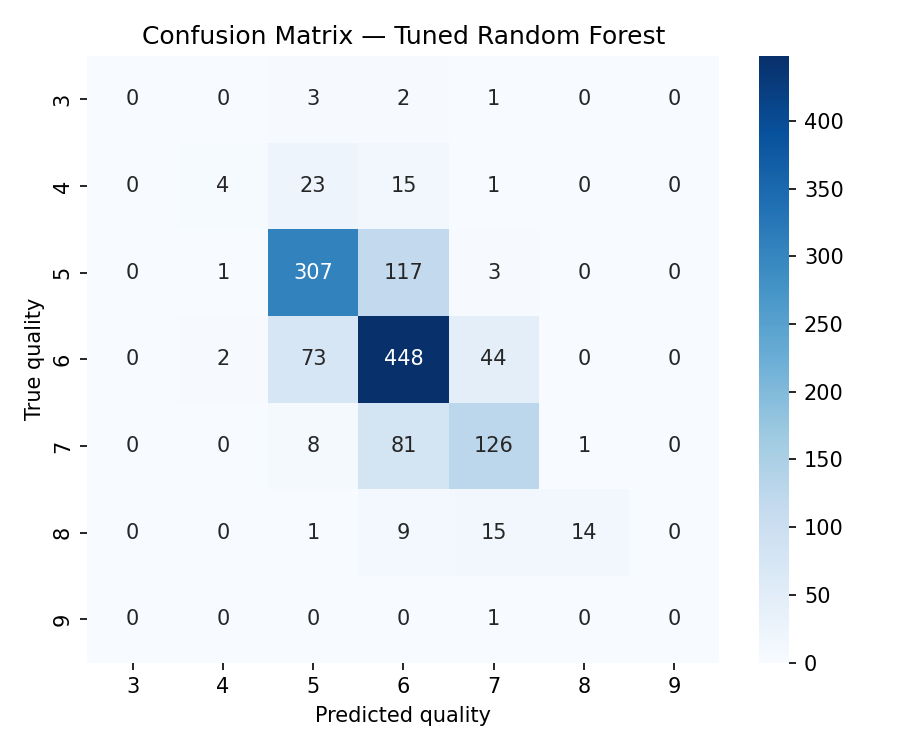
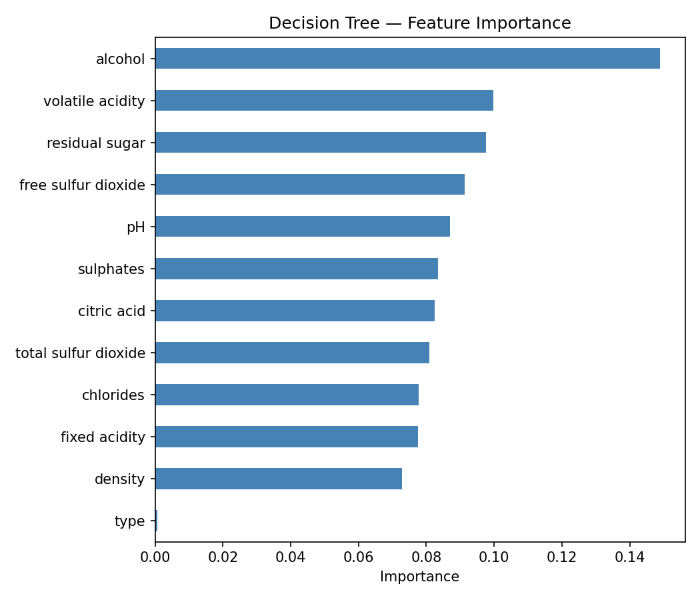
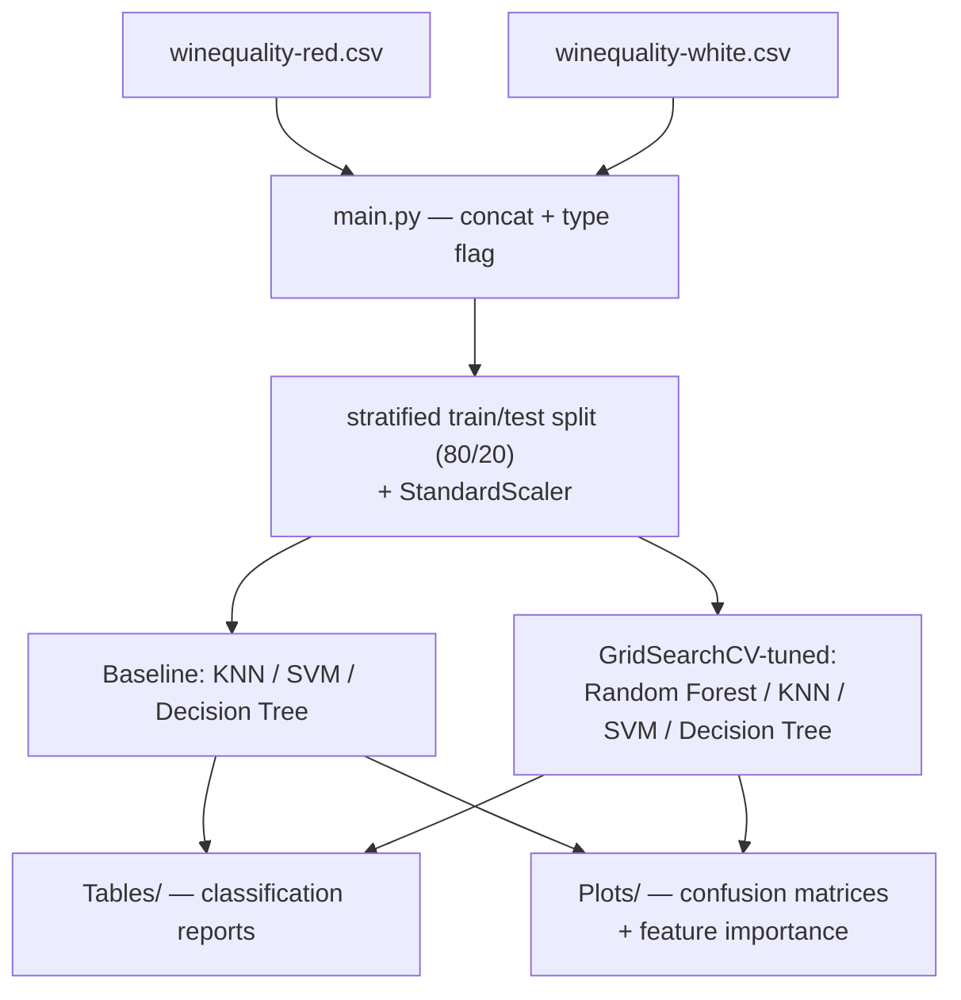

# Wine Quality Classification

Classification experiments (KNN, SVM, decision trees, and a hyperparameter-tuned random forest) on the combined UCI Wine Quality dataset (red + white), predicting wine quality (multiclass, 3–9) from 11 physicochemical attributes.

## Data

`winequality-red.csv` and `winequality-white.csv` — Vinho Verde wine samples from Cortez et al. (2009). The two are concatenated with a binary `type` indicator column and modeled jointly as a single multiclass quality-prediction problem (stratified 80/20 train/test split, seed=42).

📖 **[Full results table (incl. macro-F1) and evaluation methodology → project Wiki](https://github.com/andrm101/data-mining-classification/wiki)**

## Results at a glance

<p align="center">
  
  
</p>

## Architecture



## Running it

```bash
python main.py
```

Requires `numpy`, `pandas`, `matplotlib`, `seaborn`, `scikit-learn`. Writes classification reports to `Tables/` and confusion-matrix / feature-importance plots to `Plots/`. Paths are resolved relative to the script location, not hardcoded.

## Results (tuned models outperform baselines)

| Model | Accuracy |
|---|---|
| KNN (baseline) | ~0.56 |
| SVM (baseline) | ~0.53 |
| Decision Tree (baseline) | ~0.60 |
| Tuned Random Forest | ~0.69 |
| Tuned KNN | ~0.67 |
| Tuned SVM | ~0.59 |
| Tuned Decision Tree | ~0.60 |

Exact figures vary slightly run to run depending on `GridSearchCV` grid choices; see `Tables/classification_report_*.txt` for the current run's numbers.

## Note on statistical rigour

Classification accuracy alone is reported here; per repo conventions, any follow-on analysis reporting model comparisons should include effect sizes/confidence intervals rather than point accuracy alone. Note the class imbalance (qualities 3 and 9 have single-digit support) means macro-averaged metrics are far more informative than raw accuracy for the tails of the distribution.
